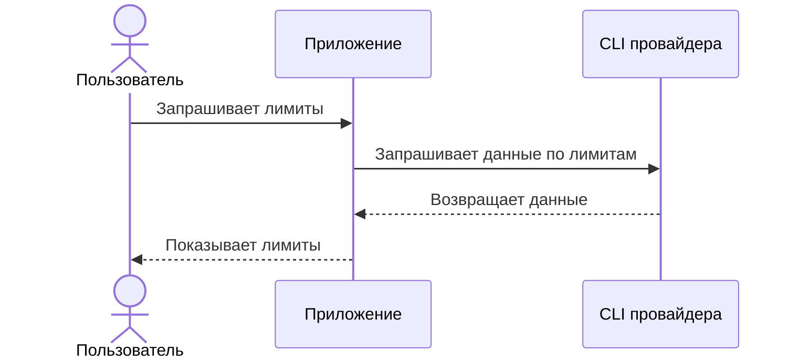

# ai-usage-mit

`ai-usage-mit` - небольшой локальный трекер использования AI CLI-инструментов и подписочных тарифов на модели.

## Проблема

Расходы на AI сложно контролировать, когда использование распределено между несколькими CLI, моделями и провайдерами. Дашборды API-биллинга помогают только тогда, когда запросы проходят через API-аккаунты, а подписочные тарифы обычно показывают квоты косвенно, непоследовательно или только внутри интерфейсов поставщика.

Это создает несколько практических рисков:

- Использование становится заметно только после достижения лимита п а
- Разные провайдеры используют разные правила квот и окна сброса
- Потребление токенов и запросов сложно сравнивать между инструментами
- Платные превышения лимитов или вынужденные апгрейды могут произойти до того, как пользователь увидит тренд
- Сторонние сервисы наблюдаемости часто слишком тяжелые, слишком дорогие или требуют отправлять трафик через еще одного поставщика

## Целевое решение

Легковесный локальный трекер, ориентированный на использование AI через CLI.

## Как это работает

Для пользователя приложение работает как черный ящик: оно обращается к CLI нужного провайдера и показывает текущие лимиты.



Подробные runtime-схемы описаны в [docs/runtime-schemas.md](docs/runtime-schemas.md).

## PoC

Текущий PoC - shell-команда `ai-usage`, которая запускает реальный Codex CLI, автоматически вызывает `/status`, выводит полученную информацию и завершает Codex.

Запуск из репозитория:

```sh
./bin/ai-usage
```

По умолчанию команда возвращает пользователю копию информации, которую Codex CLI показывает после `/status`: лимиты, кредиты, аккаунт, модель, директорию и сопутствующие параметры.

Для работы нужен установленный `expect`, на macOS он обычно доступен из коробки. По умолчанию скрипт ждет старт Codex до 20 секунд, затем еще 20 секунд готовности prompt и вывод `/status` до 20 секунд. При медленном старте значения можно увеличить через `AI_USAGE_STARTUP_WAIT`, `AI_USAGE_READY_WAIT` и `AI_USAGE_STATUS_WAIT`.

Путь к Codex CLI можно задать флагом или переменной окружения:

```sh
./bin/ai-usage --codex-bin /path/to/codex
AI_USAGE_CODEX_BIN=/path/to/codex ./bin/ai-usage
```
