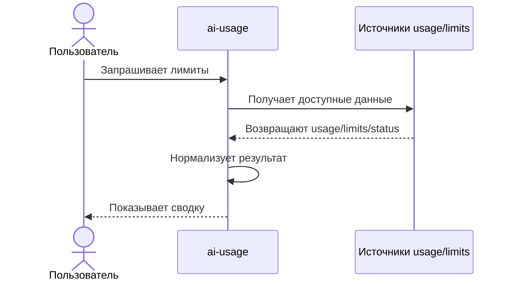

# ai-usage-mit

Небольшой локальный трекер использования AI-инструментов и подписочных тарифов на модели.

## Как это работает

Для пользователя приложение работает как локальный помощник: оно собирает доступные данные об использовании и лимитах, нормализует их и показывает понятную сводку.



Общая карта получения лимитов описана в [docs/get-limits.md](docs/get-limits.md), техническая модель provider CLI methods - в [docs/get-limits-from-provider-cli.md](docs/get-limits-from-provider-cli.md).

## PoC

Текущий PoC - команда `ai-usage`, которая одной командой получает доступную информацию по usage/limits для Codex, Claude и Cursor и завершает runtime.

Методы:

- Codex: CLI `/status`.
- Claude: CLI `/usage`.
- Cursor: внутренний `api2.cursor.sh` через токен `cursor agent login`; если API недоступен, fallback на `cursor agent about/status`.

Запуск из репозитория:

```sh
./bin/ai-usage
```

По умолчанию команда использует стандартные команды `codex`, `claude` и `cursor`. Для работы нужны установленные CLI нужных провайдеров.
