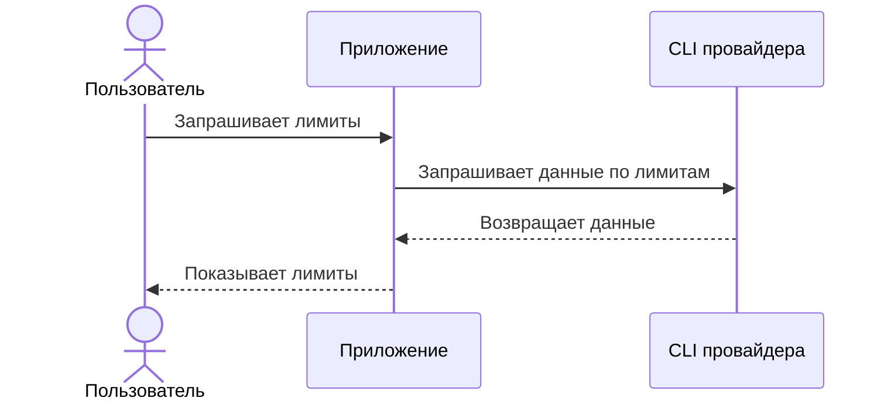

# ai-usage-mit

Небольшой локальный трекер использования AI CLI-инструментов и подписочных тарифов на модели.

## Как это работает

Для пользователя приложение работает как черный ящик: оно обращается к CLI нужного провайдера и показывает текущие лимиты.



Общая карта получения лимитов описана в [docs/get-limits.md](docs/get-limits.md), runtime-схемы - в [docs/runtime-schemas.md](docs/runtime-schemas.md).

## PoC

Текущий PoC - команда `ai-usage`, которая запускает реальные CLI Codex, Claude и Cursor, выводит доступную информацию по usage/limits и завершает runtime.

Запуск из репозитория:

```sh
./bin/ai-usage
```

По умолчанию команда использует стандартные команды `codex`, `claude` и `cursor`. Для работы нужны установленные CLI нужных провайдеров.
