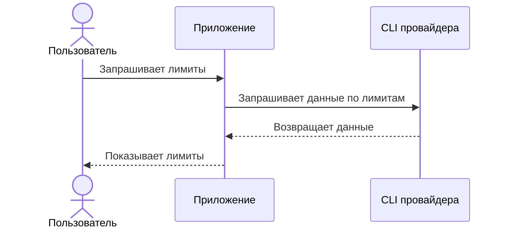

# ai-usage-mit

Небольшой локальный трекер использования AI CLI-инструментов и подписочных тарифов на модели.

## Как это работает

Для пользователя приложение работает как черный ящик: оно обращается к CLI нужного провайдера и показывает текущие лимиты.



Подробные runtime-схемы описаны в [docs/runtime-schemas.md](docs/runtime-schemas.md).

## PoC

Текущий PoC - команда `ai-usage`, которая запускает реальный Codex CLI, автоматически вызывает `/status`, выводит полученную информацию и завершает runtime.

Запуск из репозитория:

```sh
./bin/ai-usage
```

По умолчанию команда использует стандартный запуск `codex`. Для работы нужен установленный Codex CLI.
