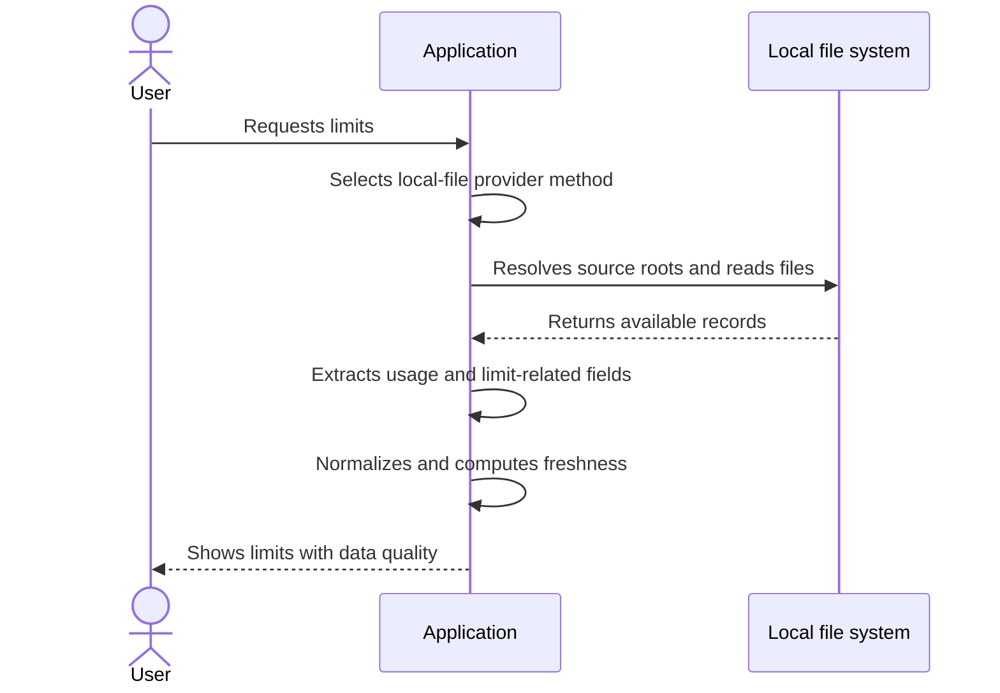
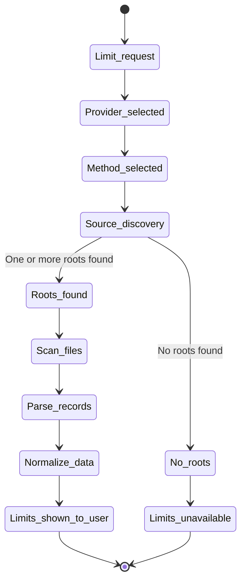

# Getting Limits From Local Files

This document describes provider methods that fetch usage/limits from local transcript or telemetry files.

---

## Base Flow

The diagram below describes the general process for a provider method that reads local files.

---

## Source Discovery and Scan

The diagram below describes local-file discovery and scan behavior.

---

## Rules

- each provider may define one or more local roots and file patterns
- root discovery must be deterministic and documented for each provider
- the scanner must read only the required files and ignore unrelated artifacts
- parsing must tolerate malformed lines and continue when safe
- deduplication rules must be explicit per provider method
- normalization must separate usage history from current live limits
- if limit fields are snapshots, the output must include freshness metadata
- if only percentages are available and absolute quota is unknown, this must be shown explicitly
- local-file methods must be read-only and must not modify provider files

---

## Data Quality and Freshness

- data quality must include source type, timestamp of latest relevant record, and confidence level
- if the latest relevant record is older than the configured staleness threshold, mark data as stale
- if files exist but no relevant records are found, return a clear `no data found` result
- if roots are missing, return a clear `source not found` result with searched roots

---

## Deviations From the Flow

- if no matching local roots exist, the application shows a clear error and next step
- if files are present but contain no parseable records, the application shows an appropriate error
- if records contain usage but no limit/reset fields, the application must show usage and mark limits as unavailable
- if multiple roots provide overlapping records, the application resolves conflicts by documented precedence
