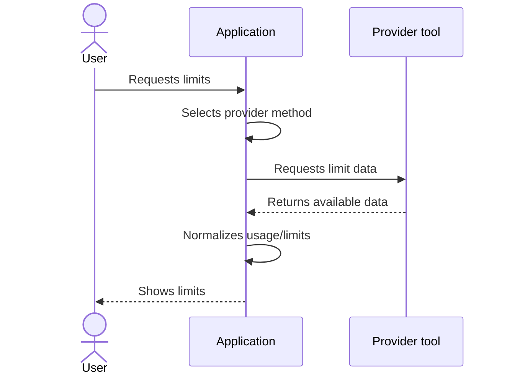
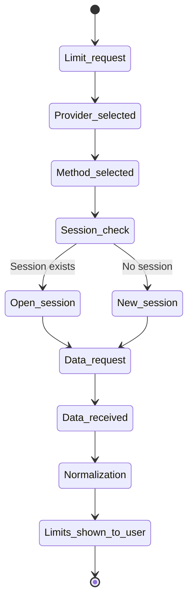

# Getting Limits Through Provider CLI

This document describes provider methods that fetch usage/limits through the local CLI or the provider's local client tool.

---

## Base Flow

The diagram below describes the general process for a provider method that uses the local CLI or local client tool.

---

## Virtual Terminal and CLI Sessions

The diagram below describes the runtime session for interactive CLIs that require a pseudoterminal.

---

## Rules

- each provider may have multiple provider methods
- the application selects the primary available method and may use a fallback if the primary method is unavailable
- for interactive CLIs, a separate runtime session may be opened in a virtual terminal
- if the user requests limits and no required runtime session exists, the application starts a new session
- if a suitable session is already open, the application may reuse it
- virtual terminals belong to the application runtime and must not outlive it
- when the application runtime terminates, all open virtual terminals must be shut down
- the application must not leave background terminals or provider CLI sessions running after it exits
- if the provider CLI supports context cleanup within an open session, the application may clear context instead of starting a new session
- context cleanup may be used to reuse a session and reduce unnecessary token consumption

---

## Runtime Shutdown

A virtual terminal lives only for the duration of the active application runtime. When the runtime terminates, the application must synchronously shut down all open virtual terminals and associated provider sessions.

This rule is for resource control: the application must not create terminals uncontrollably and leave them running after the user exits or the process stops.

---

## Deviations From the Flow

- if no matching CLI or local tool exists for the required provider, the application shows a clear error and next step
- if the CLI returned no response, the application shows an appropriate error
- if the response format could not be parsed, the application shows an appropriate error
- if a provider method requires a sensitive token, cookie, or additional login, the application must not perform the action without explicit user consent
