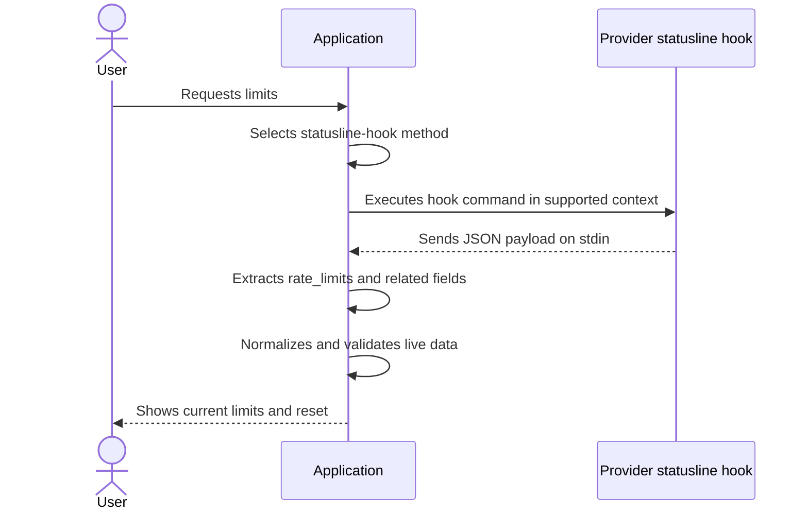
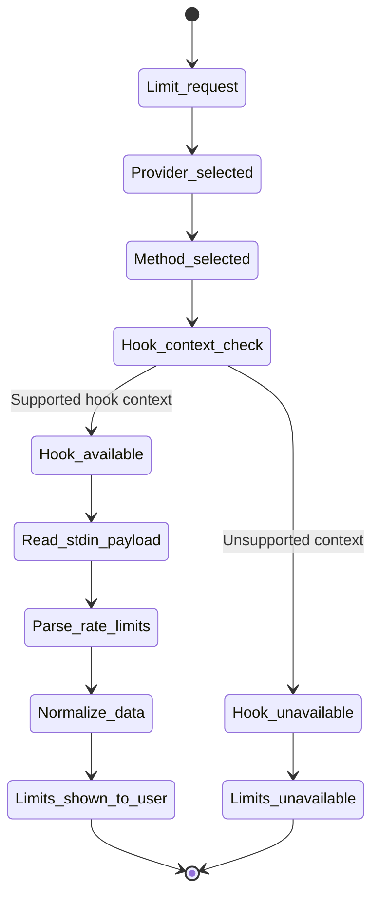

# Getting Limits From Statusline Hook

This document describes provider methods that fetch live usage/limits from statusline hook stdin payloads.

---

## Base Flow

The diagram below describes the general process for a provider method that reads hook stdin payload.

---

## Hook Runtime Context

The diagram below describes context requirements for hook-based methods.

---

## Rules

- this method is valid only for providers that expose hook payload on stdin
- hook payload parsing must be strict for required fields and tolerant for optional fields
- normalization must prioritize provider live fields over reconstructed estimates
- if payload contains `rate_limits`, output should treat it as the primary live signal
- if payload omits `rate_limits`, output must mark live limits as unavailable
- hook methods must not require TUI parsing when hook payload already includes structured fields
- method behavior must be deterministic for unsupported contexts

---

## Configuration Requirements

- provider-specific statusline command must be configured in the provider settings file
- hook command must run in the provider-supported statusline context
- stdin payload format and required fields must be documented per provider
- security-sensitive tokens from hook payload must not be persisted unless explicitly required and approved

---

## Deviations From the Flow

- if hook context is not available, the application shows a clear unavailable state and fallback option
- if stdin is empty or invalid JSON, the application shows an appropriate parse error
- if payload exists but lacks limit fields, the application shows usage context and marks limits as unavailable
- if provider changes payload schema, the application must fail safely and report unsupported schema
