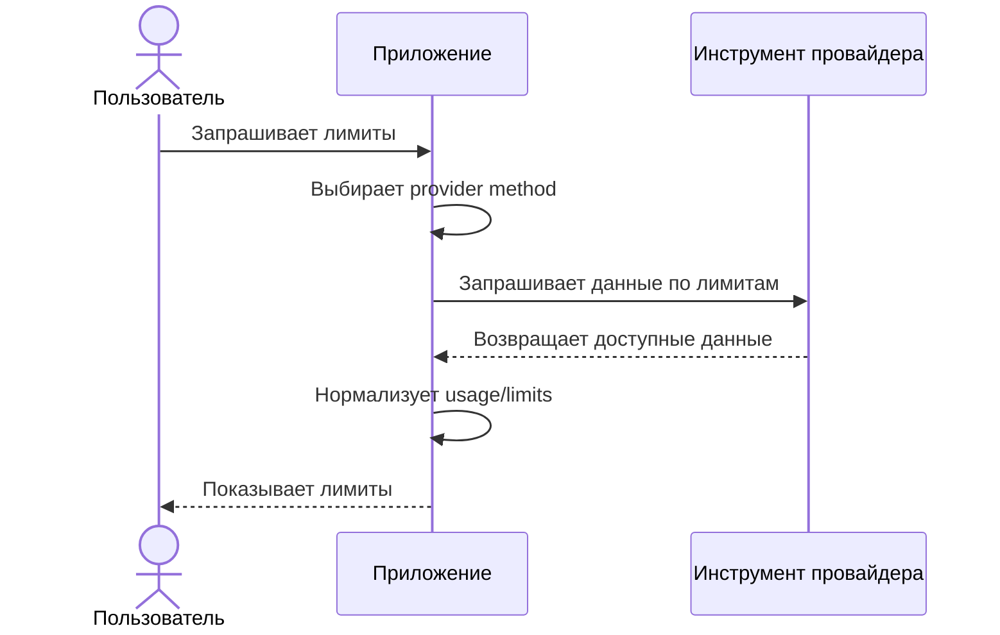
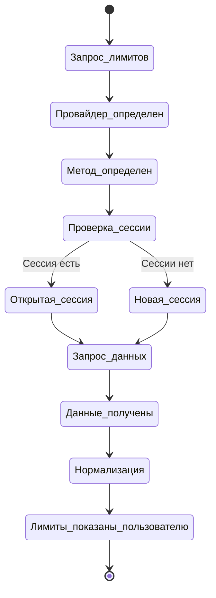

# Получение Лимитов Через CLI Провайдера

Документ описывает provider methods, которые получают usage/limits через локальный CLI или локальный клиентский инструмент провайдера.

---

## Базовая Схема

Диаграмма описывает общий процесс для provider method, который использует локальный CLI или локальный клиентский инструмент.

---

## Виртуальный Терминал И CLI-Сессии

Диаграмма описывает runtime-сессию для интерактивных CLI, где нужен псевдотерминал.

---

## Правила

- для каждого провайдера может быть несколько provider method
- приложение выбирает основной доступный метод и может использовать fallback, если основной метод недоступен
- для интерактивных CLI может быть открыта отдельная runtime-сессия в виртуальном терминале
- если пользователь запрашивает лимиты, а нужной runtime-сессии нет, приложение запускает новую сессию
- если подходящая сессия уже открыта, приложение может переиспользовать ее
- виртуальные терминалы принадлежат runtime приложения и не должны жить отдельно от него
- при завершении runtime приложения все открытые виртуальные терминалы должны быть завершены
- приложение не должно оставлять фоновые терминалы или CLI-сессии провайдеров после своего завершения
- если CLI провайдера поддерживает очистку контекста внутри открытой сессии, приложение может очищать контекст вместо запуска новой сессии
- очистка контекста может использоваться как способ переиспользовать сессию и снижать лишний расход токенов

---

## Диагностика PoC

Для диагностики PoC создает runtime-каталог `.runtime/ai-usage/<timestamp>-<pid>/`.

В runtime-каталог пишутся:

- `events.log`
- `expect.script.tcl`
- `stdin.sent.log`
- `stdout.raw`
- `stderr.raw`
- `stdout.cleaned.txt`
- `stdout.compacted.txt`

Для провайдеров с несколькими сценариями файлы могут получать префикс провайдера, например `claude.stdout.raw` или `cursor.stdout.raw`.

Диагностические файлы нужны для анализа порядка действий и фактических потоков CLI. Это не пользовательский формат MVP.

---

## Завершение Runtime

Виртуальный терминал живет только в рамках активного runtime приложения. Если runtime завершается, приложение должно синхронно завершить все открытые виртуальные терминалы и связанные с ними сессии провайдеров.

Это правило нужно для контроля ресурсов: приложение не должно бесконтрольно создавать терминалы и оставлять их работать после выхода пользователя или остановки процесса.

---

## Отклонения От Сценария

- если нет соответствующего CLI или локального инструмента для нужного провайдера, приложение показывает понятную ошибку и следующий шаг
- если CLI не вернул ответ, приложение показывает соответствующую ошибку
- если формат ответа не удалось распарсить, приложение показывает соответствующую ошибку
- если provider method требует чувствительный токен, cookie или дополнительный login, приложение не должно выполнять действие без явного согласия пользователя
