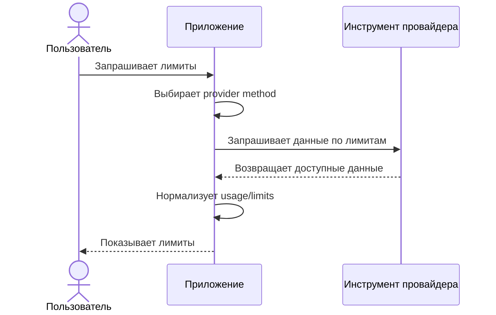
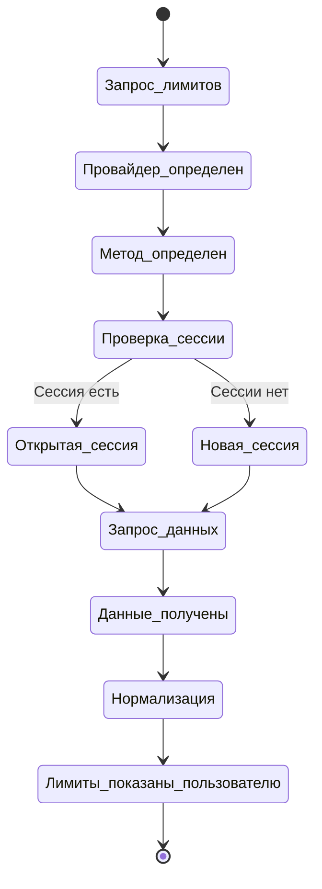

# Runtime-схемы

## Базовая схема runtime

Диаграмма описывает общий процесс для provider method, который использует локальный CLI или локальный клиентский инструмент.

## Виртуальный терминал и CLI-сессии

Диаграмма описывает runtime-сессию для интерактивных CLI, где нужен псевдотерминал.

## Общие правила runtime

- Для каждого провайдера может быть несколько provider method.
- Приложение выбирает основной доступный метод и может использовать fallback, если основной метод недоступен.
- Для интерактивных CLI может быть открыта отдельная runtime-сессия в виртуальном терминале.
- Если пользователь запрашивает лимиты, а нужной runtime-сессии нет, приложение запускает новую сессию.
- Если подходящая сессия уже открыта, приложение может переиспользовать ее.
- Виртуальные терминалы принадлежат runtime приложения и не должны жить отдельно от него.
- При завершении runtime приложения все открытые виртуальные терминалы должны быть завершены.
- Приложение не должно оставлять фоновые терминалы или CLI-сессии провайдеров после своего завершения.
- Если CLI провайдера поддерживает очистку контекста внутри открытой сессии, приложение может очищать контекст вместо запуска новой сессии.
- Очистка контекста может использоваться как способ переиспользовать сессию и снижать лишний расход токенов.
- MVP должен поддерживать Claude, Codex и Cursor, но способы получения данных могут отличаться.

## Диагностика PoC

Для диагностики PoC создает runtime-каталог `.runtime/ai-usage/<timestamp>-<pid>/`.

В runtime-каталог пишутся:

- `events.log`
- `expect.script.tcl`
- `stdin.sent.log`
- `stdout.raw`
- `stderr.raw`
- `stdout.cleaned.txt`
- `stdout.compacted.txt`

Для провайдеров с несколькими сценариями файлы могут получать префикс провайдера, например `claude.stdout.raw` или `cursor.stdout.raw`.

Диагностические файлы нужны для анализа порядка действий и фактических потоков CLI; это не пользовательский формат MVP.

## Завершение runtime

Виртуальный терминал живет только в рамках активного runtime приложения. Если runtime завершается, приложение должно синхронно завершить все открытые виртуальные терминалы и связанные с ними сессии провайдеров.

Это правило нужно для контроля ресурсов: приложение не должно бесконтрольно создавать терминалы и оставлять их работать после выхода пользователя или остановки процесса.

## Отклонения от сценария

- Если нет соответствующего CLI или локального инструмента для нужного провайдера, приложение показывает понятную ошибку и следующий шаг.
- Если CLI не вернул ответ, приложение показывает соответствующую ошибку.
- Если формат ответа не удалось распарсить, приложение показывает соответствующую ошибку.
- Если provider method требует чувствительный токен, cookie или дополнительный login, приложение не должно выполнять действие без явного согласия пользователя.
