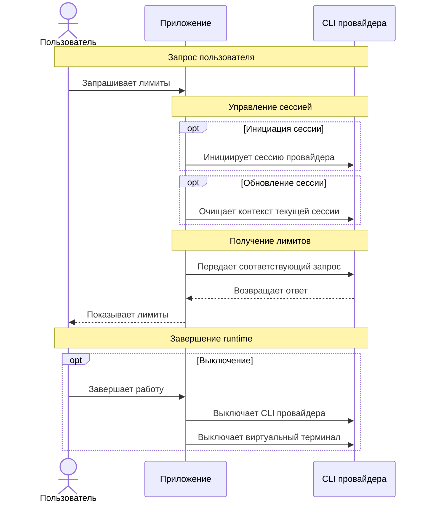
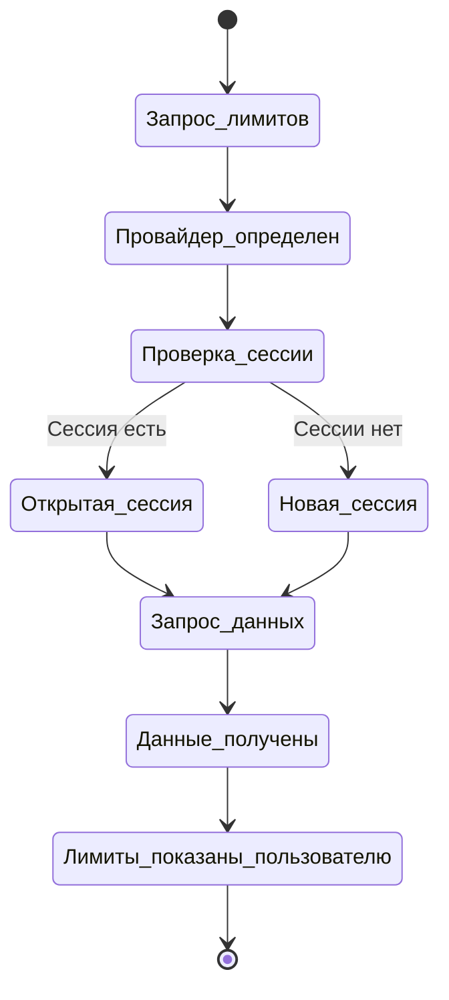

# Runtime-схемы

## Базовая схема runtime

Диаграмма описывает усредненный процесс для всех провайдеров.

Уточнения:

- Если провайдеров несколько, приложение может параллельно работать с несколькими CLI-сессиями.
- Пользователь не видит управление CLI-сессиями, но видит текущие лимиты.

## Виртуальный терминал и сессии провайдеров

Диаграмма описывает бизнес-процесс работы с runtime-сессией провайдера.

## Правила работы с runtime-сессиями

- Для каждого провайдера может быть открыта отдельная runtime-сессия в виртуальном терминале.
- Если пользователь запрашивает лимиты, а сессии нужного провайдера нет, приложение запускает новую сессию.
- Если сессия нужного провайдера уже открыта, приложение переиспользует ее.
- Виртуальные терминалы принадлежат runtime приложения и не должны жить отдельно от него.
- При завершении runtime приложения все открытые виртуальные терминалы должны быть завершены.
- Приложение не должно оставлять фоновые терминалы или CLI-сессии провайдеров после своего завершения.
- Если CLI провайдера поддерживает очистку контекста внутри открытой сессии, приложение может очищать контекст вместо запуска новой сессии.
- Очистка контекста должна использоваться как способ переиспользовать сессию и снижать лишний расход токенов.
- PoC может поддерживать только Codex.
- MVP должен расширить этот подход на Claude, Codex и Cursor.

## Завершение runtime

Виртуальный терминал живет только в рамках активного runtime приложения. Если runtime завершается, приложение должно синхронно завершить все открытые виртуальные терминалы и связанные с ними сессии провайдеров.

Это правило нужно для контроля ресурсов: приложение не должно бесконтрольно создавать терминалы и оставлять их работать после выхода пользователя или остановки процесса.

## Отклонения от сценария

- Если нет соответствующего CLI для нужного провайдера, приложение предлагает пользователю установить его.
- Если пользователь соглашается установить CLI, это можно сделать сразу короткой командой `y`.
- Если CLI не вернул ответ, приложение показывает соответствующую ошибку.
- Если формат ответа CLI не удалось распарсить, приложение показывает соответствующую ошибку.
